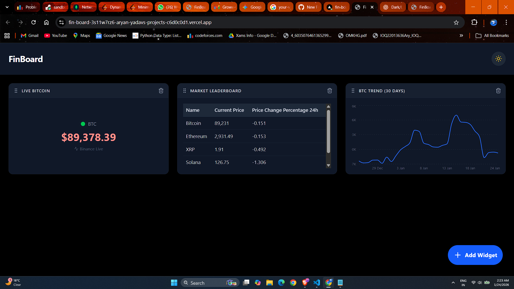

# 🚀 FinBoard - Real-Time Financial Dashboard

> **A high-performance, customizable dashboard for tracking crypto and stock markets in real-time.**

FinBoard is a responsive, feature-rich frontend application built with **Next.js 15** and **Tailwind CSS**. It solves common dashboard challenges like **API rate limiting**, **mobile drag-and-drop interactions**, and **real-time WebSocket state management**.

---

## ✨ Key Features

### ⚡ **Real-Time Data Engine**
- **Hybrid Architecture:** Utilizes **WebSockets** (Binance API) for sub-millisecond crypto updates and **Smart Polling** (Finnhub/CoinGecko) for stock data.
- **Connection Resilience:** Auto-reconnecting socket layer ensures the ticker never freezes.

### 🎨 **Advanced UX/UI**
- **Drag-and-Drop Layout:** Fully customizable grid using `@dnd-kit`.
- **Mobile Optimized:** Custom **Touch Sensors** ensure seamless dragging on phones without conflicting with page scrolling.
- **System-Aware Dark Mode:** Persists user preference via `next-themes` and eliminates flash-of-unstyled-content (FOUC).

### 🛡️ **Engineering Highlights (The "Under the Hood" Stuff)**
- **API Rate Limit Proxy:** Implemented a custom server-side token bucket algorithm to strictly adhere to Finnhub's **60 requests/minute** limit, preventing `429 Too Many Requests` errors.
- **Optimized Re-rendering:** Components use **Zustand** for granular state management, ensuring only the changing widget updates, not the entire board.

---

## 🛠️ Tech Stack

| Category | Technology |
|----------|------------|
| **Framework** | Next.js 15 (App Router) |
| **Styling** | Tailwind CSS + Lucide Icons |
| **State Management** | Zustand |
| **Visualization** | Recharts (Responsive Charts) |
| **Interactions** | @dnd-kit (Sortable & Core) |
| **Deployment** | Vercel |

---

## 🚀 Getting Started

### Prerequisites
- Node.js 18+
- npm / yarn

📦 Installation
1. Clone the repository
git clone https://github.com/Sandrocottus1/finboard.git
cd finboard

2. Install dependencies
npm install

3. Set up environment variables

Create a .env.local file in the root directory and add your API key:

NEXT_PUBLIC_FINNHUB_API_KEY=your_api_key_here

4. Run the development server
npm run dev

The application will be available at:
👉 http://localhost:3000

